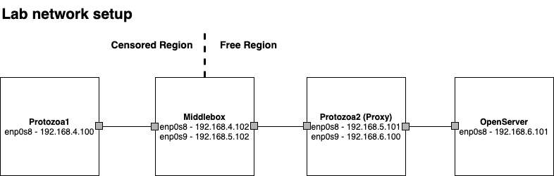

# Protozoa

This repository holds the code for the paper "Poking a Hole in the Wall: Efficient Censorship-Resistant Internet Communications by Parasitizing on WebRTC". 
If you end up using our code for your experiments, please cite our work as follows:

```
@inproceedings{protozoa,
  title={Poking a Hole in the Wall: Efficient Censorship-Resistant Internet Communications by Parasitizing on WebRTC},
  author={Barradas, Diogo and Santos, Nuno and Rodrigues, Lu{\'i}s and Nunes, V{\'i}tor},
  booktitle={Proceedings of the ACM SIGSAC Conference on Computer and Communications Security},
  year={2020},
  address={Virtual Event, USA}
}
```

# Protozoa Guide

## Repository Organization

This repository is split into four main folders:

- `machine_setup`: Holds a Vagrant script for setting up our VMs & reproducing our lab environment.

- `protozoa`: Holds the code for the Protozoa tool, including the hooks placed in the Chromium browser.

- `analytics`: Holds our feature extraction and classification scripts.

- `experiments_middlebox`: Holds the scripts for collecting a dataset composed of regular & Protozoa WebRTC connection.

## Protozoa Setup

Our laboratory setup assumes the existence of 4 VMs (16GB RAM, 4vCPUs each) running in separate physical machines. While this configuration may be adjusted to better suit your needs, this setup guide follows the details of the figure below. We used **Vagrant v2.2.3**.




### 1. Spin up Vagrant VMs

The first step of this guide involves spinning up the VMs acting as the Protozoa client/proxy, as well as the middlebox machine and a server acting like some free Internet service. If you're in a hurry and just want to try Protozoa, you just need to spin up the `protozoa1` and `protozoa2` machines.

Start by installing the following Vagrant plugins:

```
vagrant plugin install vagrant-reload
vagrant plugin install vagrant-vbguest	
vagrant plugin install vagrant-disksize
```
	
Then, copy the Vagrantfile to an appropriate folder in your physical machine and run:

`vagrant up <protozoa-machine>`

The Vagrantfile comprises provisioning routines which will fetch all the required software, including the specific Chromium browser version where Protozoa hooks will be included.

### 2. Start media emulators

Now that your Protozoa VMs are running, connect to them via `vagrant ssh <protozoa-machine>`. 
In each Protozoa VM, start the required media emulators:

**Video camera emulator**  
``sudo modprobe v4l2loopback exclusive-caps=1``

**Audio microphone emulator**  
``sudo modprobe snd_aloop``


### 3. Set display properties

Running Chromium requires a GUI display. To turn on a display, you can do as follows:

- Connect to your physical machine via ``ssh -X`` and turn on virtualbox GUI `virtualbox &`. Log into the protozoa VM and issue ``startx`` for starting the desktop environment.

- For allowing the automation of WebRTC applications in our experiments, set the display to a fixed `1280x768 Resolution` and maximize the Chromium browser window. At time of writing, this display configuration allows us to automate point-and-click for joining `appr.tc` and `coderpad.io` chatrooms. 

- You may now quit the virtualbox GUI while letting the VM to continue running in background.

- Connect again to the protozoa machines via ssh and allow the root user to use the GUI for displaying Chromium:    
``DISPLAY=:0.0 xhost +SI:localuser:root``


### 4. Set up routes between machines

To reproduce our lab testbed, you must configure the following routes:


```
# Machine 1 (Protozoa1):
route add default gw 192.168.4.102

# Machine 2 (Middlebox):
ip route add 192.168.6.0/24 via 192.168.5.102 dev enp0s9
sysctl -w net.ipv4.ip_forward=1
iptables -t nat -A POSTROUTING -o enp0s3 -j MASQUERADE

# Machine 3 (Protozoa2):
ip route add 192.168.6.0/24 via 192.168.6.100 dev enp0s9
route add default gw 192.168.5.102

#Machine 4 (3rd Party): Add route to machine 1 and 2
sudo ip route add 192.168.4.0/24 via 192.168.6.101 dev enp0s8
sudo ip route add 192.168.5.0/24 via 192.168.6.101 dev enp0s8
```

### 5. Compile Chromium

The `machine_setup/compile_chromium.py` script will produce two Chromium builds: a vanilla Chromium version compile and a protoza-infused Chromium version. These builds will live in `/home/vagrant/chromium_builds/`. 

### 6. Run Protozoa

**Set up the covert channel:**

Exchanging arbitrary IP data over WebRTC video channels involves three main steps in the `protozoa1` (client) and `protozoa2` (server) machines:

- Provide a video stream to a camera device (we will be using the `v4l2loopback` device started in Step 1)  
`sudo ffmpeg -nostats -re -i <some_video.mp4> -r 30 -vcodec rawvideo -pix_fmt yuv420p -threads 0 -f v4l2 /dev/video0`

- Start Protozoa client/server  
`cd Protozoa/protozoa/bin`
`sudo ./protozoa -m <client/server>`

- Start the modified Chromium browser
`DISPLAY=:1.0 sudo /home/vagrant/chromium_builds/protozoaReplacementFullFrame_build/chrome --disable-session-crashed-bubbles --disable-infobars --no-sandbox https://whereby.com/<your_chatroom_id>`

From this point on, the covert channel will be established, and we can run some application.

**Run an application over the covert channel:**

Fetch Facebook page via `curl`:
`sudo ip netns exec PROTOZOA_ENV curl -x socks5h://20.20.20.20:1080 https://www.facebook.com > fb.html`

Use `httpping` against the openserver VM:

`sudo ip netns exec PROTOZOA_ENV proxychains4 -f ~/home/vagrant/protozoa/experiments_middlebox/proxychains.conf httping 192.168.6.101`

Measure network performance against the openserver VM using `iperf3`:

`sudo ip netns exec PROTOZOA_ENV proxychains4 -f home/vagrant/protozoa/experiments_middlebox/proxychains.conf iperf3 -c 192.168.6.101 -t 25 -f K`

## Encrypted Traffic Analysis

The necessary scripts used for performing encrypted traffic analysis over Protozoa connections are available in the `analytics` folder. These include:

- `feature_extractor.py`: Extract features from legitimate / Protozoa WebRTC network traffic
- `traffic_classifier.py`: Classify flows using the [state-of-the-art classifier](https://github.com/dmbb/MPTAnalysis) for detecting multimedia covert channels.

**Note:** Get in touch if you'd like to explore our dataset!

## Collecting Your Own Dataset

You may collect your own dataset by using the scripts in the `experiments_middlebox` folder. These scripts coordinate the nodes in our testbed ensuring that a) Protozoa nodes can automatically establish a covert channel, b) the middlebox captures the traffic of each covert channel session, c) the openserver exposes a given application to be tested.

To start an experiment:

- Start `openserver_control.py` at the Openserver (`openserver`) machine
- Start `receiver_control.py` at the Protozoa proxy (`protozoa2`) machine
- Start `middlebox_control.py` at the Middlebox (`middlebox`) machine
- Finally, configure the experiment and launch the experiment with the help of `sender_control_openserver.py` at the Protozoa client (`protozoa1`) machine. You may need to update the paths for the video files you intend to use in your baselines.
